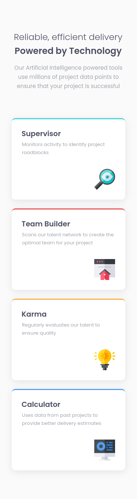
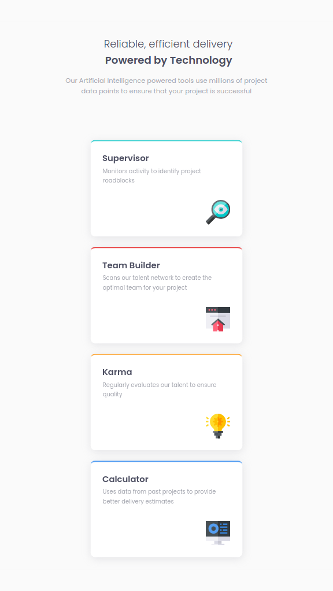
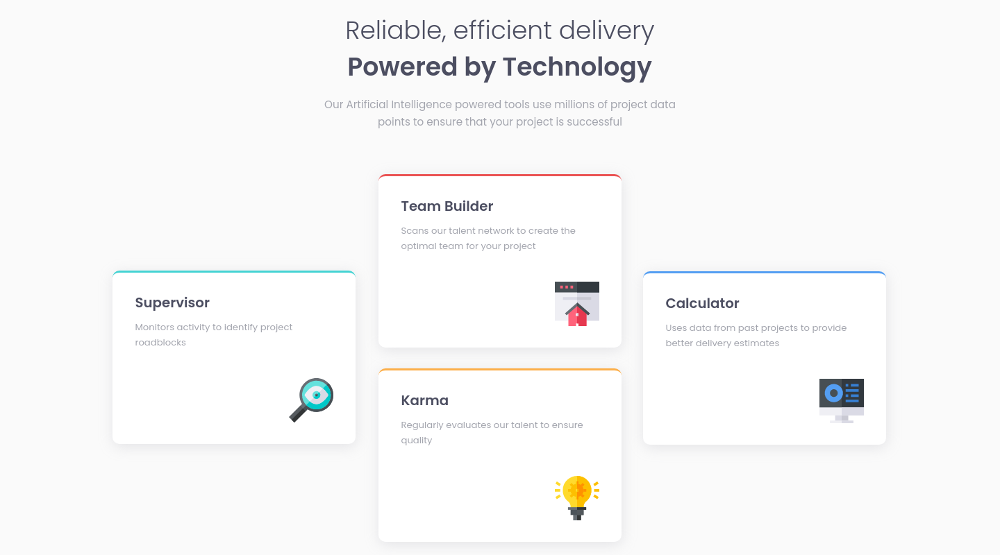
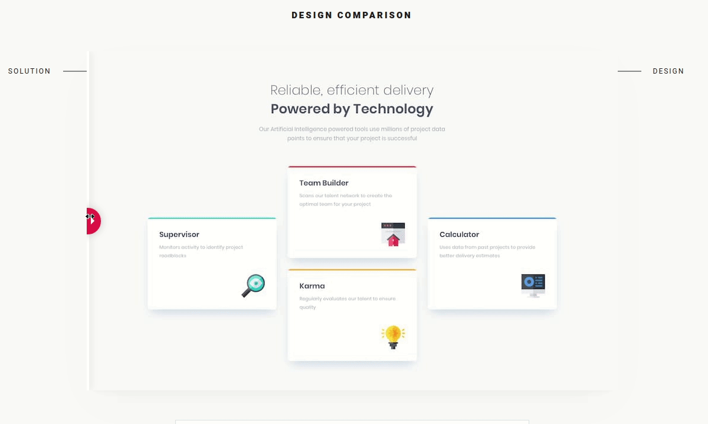

# Frontend Mentor - Four card feature section solution

This is a solution to the [Four card feature section challenge on Frontend Mentor](https://www.frontendmentor.io/challenges/four-card-feature-section-weK1eFYK). Frontend Mentor challenges help you improve your coding skills by building realistic projects.

## Table of contents

- [Overview](#overview)
  - [The challenge](#the-challenge)
  - [Screenshot](#screenshot)
  - [Links](#links)
- [My process](#my-process)
  - [Built with](#built-with)
  - [What I learned](#what-i-learned)
  - [Useful resources](#useful-resources)
- [Author](#author)

## Overview

This is the front-end mentor's sixth challenge. The challenge is to build the "Four card feature" and make it as close to the design as possible. Building the desing with whatever you want to finish, any language, framework or tools.

### The challenge

Users should be able to:

- View the optimal layout for the section depending on their device's screen size
<!--

## Screenshot

### Mobile design

<p  align="center">
  </img>
</p>

### Tablets design

<p  align="center"></img></p>

### Desktop design

<p  align="center"></img></p>

### result of my work

<p  align="center"></img></p> -->

### Links

<!--
- Solution URL: [My solution for this challenge](https://www.frontendmentor.io/solutions/social-proof-with-reactjs-fOSUMfzW_)
- Live Site URL: [check the result ](https://jcdmeira-social-proof.netlify.app) -->

- My figma design: [Figma](https://www.figma.com/file/hsLKzISvAAFDmHlVKipjxw/06-Four-card-feature?node-id=0%3A1)

## My process

### Built with

- Flexbox
- Mobile-first workflow
- [React](https://reactjs.org/) - JS library

<!--

### What I learned

Due to the use of different images for mobile and desktop devices it is possible to use ternary operation in the image path, giving the desired result.

```jsx
 1023 ? backTopDesktop : backTopMobile}
  alt=""
/>
```

To show the rating from 0 to 5 stars it is possible to make an array with 5 positions, filled with false in all positions, then the component receives the numeric value of the rating through the props, iterating over the array and changing the values from false to true according to the value received by the props. If you get 0 none are changed, while 5 all are changed.
Inside the component's return it traverses the constant, where for each "true" value it renders a filled star, and for each "false" an empty star, forming the note.

````JSX

function StarField({ value, children }) {
  const mapV = [false, false, false, false, false];

  for (let i = 0; i < value; i++) {
    mapV[i] = true;
  }
  return (
    <div className="field">
      <div className="stars">
        {mapV.map((p, index) => {
          return p === true ? (
            
          ) : (
            
          );
        })}
      </div>
      <div>
        <p>{children}</p>
      </div>
    </div>
  );
}

export { StarField };

``` -->

### Useful resources

- [react tutorial](https://pt-br.reactjs.org/tutorial/tutorial.html) - This helped me structure the components and build the proposed page.
- [my figma design](https://www.figma.com/file/N0GBXW15RxbMLwgolSHLND/05---social-proof?node-id=0%3A1) - My figma design for help anyone who wants to build this challenge.
- [CSS units conversor - px to VH/VW/REM](https://it-news.pw/pxtovh/) - CSS units conversor .

## Author

- Personal Page - [Jean Carlos De Meira](https://jcdmeira.github.io)
- Frontend Mentor - [@JCDMeira](https://www.frontendmentor.io/profile/JCDMeira)
- Instagram - [@jean.meira10](https://www.instagram.com/jean.meira10/)
- GitHub - [JCDMeira](https://github.com/JCDMeira)

```

```
